# apple-fm

**Apple Intelligence from your command line and your code.** apple-fm gives you
the on-device **Foundation Models** on **macOS 26+ / Apple Silicon** — free,
private, and fully offline. No API key, no network, nothing leaves your Mac.

Apple ships these models as a Swift-only framework with no command-line
front-end. apple-fm provides one — a fast, lightweight CLI and a TypeScript
library, so you can use the on-device model from your terminal or your code.

<p align="center">
  
</p>

## Why apple-fm

- **On-device & private.** Runs on the model Apple Intelligence already
  installed. No key, no cloud, no telemetry — your prompts never leave the
  machine.
- **One binary, three shapes.** `probe`, one-shot `generate` (freeform, guided,
  or streamed), and an interactive `chat` — all over a single
  [NDJSON protocol](docs/4-protocol.md).
- **Guaranteed structured output.** Hand it a JSON Schema and the output is
  *guaranteed* to conform — native guided generation built on Apple's
  `DynamicGenerationSchema`, not best-effort prompting. Stream it, too.
- **Long conversations stay coherent — and cheap.** `chat` holds one on-device
  session across turns, reusing the model's cache instead of replaying the
  transcript, and automatically summarizes older turns as the small context
  window fills.
- **Lightweight, nothing to audit.** Zero runtime dependencies — apple-fm just
  talks to the on-device model and gets out of your way.
- **Future-proof.** The helper resolves the current on-device model at runtime,
  so OS and model updates are picked up without a rebuild.

## Install

```bash
npm install -g apple-fm     # CLI
npm install apple-fm        # library
```

Requires macOS 26+ on Apple Silicon with Apple Intelligence enabled. Every
release is Developer-ID signed and notarized, so it runs without security
prompts.

### Platform support

apple-fm **installs on any OS** — so it can be a dependency of a cross-platform
project — but the on-device model only *runs* on **macOS 26+ Apple Silicon**.
Everywhere else it degrades gracefully instead of crashing: `probe()` returns
`{ available: false, reason: 'unsupportedPlatform' }`, and `generate` / `chat`
throw a clear `[unsupportedPlatform]` error. Gate on `isPlatformSupported()` or
`probe()`:

```ts
import { isPlatformSupported, probe, generate } from 'apple-fm';

if ((await probe()).available) {
  await generate({ prompt: '…' });
} else {
  // fall back (cloud model, cached result, skip the feature, …)
}
```

## CLI

```bash
apple-fm probe                       # is the on-device model available?
apple-fm generate "Summarize: …"     # one-shot text
cat notes.md | apple-fm generate     # read the prompt from stdin
apple-fm generate "…" --stream       # stream tokens as they arrive
apple-fm generate "…" --schema shape.json   # structured/guided JSON output
apple-fm chat                        # interactive chat (streamed, auto-compacted)
```

Run `apple-fm --help` for the full flag list.

### Check availability

Before generating, confirm Apple Intelligence is ready on this machine.

<p align="center">
  
</p>

### Structured output

Pass a JSON Schema with `--schema` and apple-fm returns JSON **guaranteed to
conform** to it — native guided generation, not prompt-and-hope — ready to pipe
into the rest of your tooling.

<p align="center">
  
</p>

### Interactive chat

`chat` is a multi-turn REPL that streams replies and compacts the transcript
automatically near the context window. Built-in slash commands: `/reset`,
`/system`, `/clear`, `/compact`, `/help`, `/quit`.

<p align="center">
  
</p>

## Library

```ts
import { probe, generate, ChatSession } from 'apple-fm';

if ((await probe()).available) {
  // One-shot
  const summary = await generate({ prompt: 'Summarize: …', system: 'Be terse.' });

  // Streaming
  await generate({ prompt: '…', stream: true }, {}, (chunk) => process.stdout.write(chunk));

  // Guaranteed structured output — pass a JSON Schema, get conforming JSON back
  const json = await generate({ prompt: 'A classic sci-fi novel', schema: novelSchema });

  // Multi-turn chat: one persistent on-device session, auto-compacted
  const chat = new ChatSession({ system: 'You are a helpful assistant.' });
  const reply = await chat.send('Hello');
}
```

The full API (`probe`, `generate`, `ChatSession`, protocol helpers, and types) is
documented in [docs/ai/code-summary.md](docs/ai/code-summary.md).

## How it works

apple-fm talks to the same on-device model that powers Apple Intelligence —
nothing is sent to the cloud. For chat it keeps one model session alive across
turns so replies stay fast, and automatically summarizes older messages as the
context window fills, so long conversations stay coherent and cheap. And because
it resolves the current on-device model at runtime, OS and model updates are
picked up automatically — no reinstall.

## Documentation

- [Overview](docs/1-overview.md)

## Disclaimer

apple-fm is an independent, unofficial project and is **not affiliated with,
endorsed by, or sponsored by Apple Inc.** It simply provides command-line and
programmatic access to Apple's on-device Foundation Models on machines that
already support them (macOS 26+ on Apple Silicon with Apple Intelligence enabled).
Apple, Apple Intelligence, Apple Silicon, Foundation Models, and macOS are
trademarks of Apple Inc.

## License

MIT © Brian Westphal
